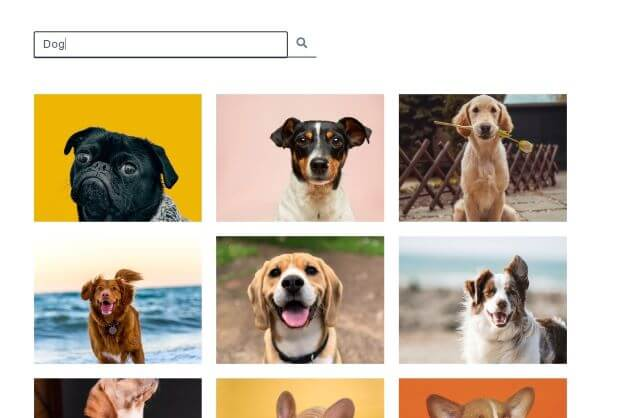

# React - StockPhotos

[This project](https://gurhanalan.github.io/React-StockPhotos/) is component that lists stock photos from unsplash API. This component is build with using React.

## Table of contents

- [React - StockPhotos](#react---stockphotos)
  - [Table of contents](#table-of-contents)
  - [Overview](#overview)
    - [The challenge](#the-challenge)
    - [Screenshots](#screenshots)
    - [Links](#links)
  - [My process](#my-process)
    - [Built with](#built-with)

## Overview

### The challenge

Users should be able to:

<!-- -   View the optimal layout for the app depending on their device's screen size -->

-   Get the list of photos from API call
-   Search for photos
-   Scrool down to get more photos

<!-- -   Change the position, color, shape and size of a box by click the control buttons. -->

### Screenshots

<!--   -->

 

<!--  -->

### Links

-   Solution URL: [Live Website](https://gurhanalan.github.io/React-StockPhotos/)

## My process

### Built with

-   React
-   Functional Components
-   CSS
-   React Hooks
-   API
